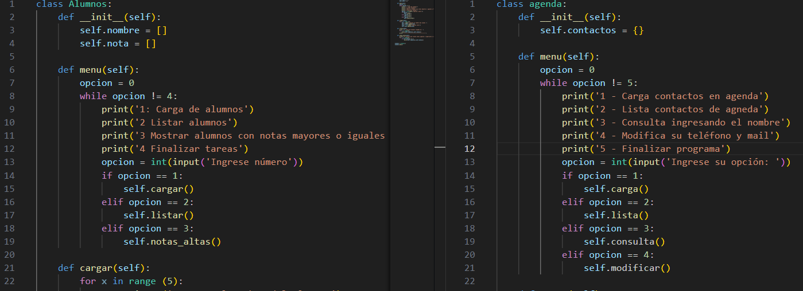

#  Hola, mi nombre es Alejandro Lorenzut 👋
### Trabajo en la Escuela de Educación Secundaria Técnica N° 6 "Albert Thomas" de la ciudad de la Plata.

### Soy profesor de prácticas profesionalizantes de la especialidad Técnco en electrónica.
### Desde mi espacio conseguí crear un entorno formativo provisto de equipos e insumos electrónicos destinados a la realización de proyectos de extensión que vinculan a nuestra escuela con organismos dependientes de la Universidad Nacional de La Plata y laboratorios dependientes del CONICET.

## Tecnologías:

Y alguna más...
## También estoy en:

# Los proyectos del ciclo lectivo 2024

## IAR Telemetría

### Proyecto donde se realizan seis mediciones de temperatura, tres mediciones de tensión y tres mediciones de corriente. Proyecto propuesto por el Instituto Argentino de Radioastronomía (CONICET)
### Las variables son enviadas a un servidor a través de comunicación UDP Ethernet, alli se muestran en un interfáz gráfico y se almacena en una planilla de Excel.

___

## IAR SGI SCAP
### Proyecto a demanda del Instituto Argentino de Radioastronomía (CONICET).
### Consta de Terminales registradoras conectadas a un servidor mediante WiFi protocolo MQTT. Mediante Node Red se visualiza el desplazamiento de instrumental como así también del personal. 
### Los datos se almacenan en una base de datos mysql.

___

## LIDMA
### Desarrollo de un proyecto a demanda del Lasboratorio de Investigación y Desarrollo de Métodos Analíticos  (CONICET).
### Desarrollo de un horno de cocción dinámica de capilares.

___

## Forestales
### Proyecto a demanda de la Facultad de Ciencias Agrarias y Forestales. 
### Consta de un sistema de adquisición de datos como la humedad en el suelo y captura una imagen de las plantas de tala. A través un módulo LoRa se envían a un servidor donde se realiza reconocimiento de imágen y se establece el ritmo de crecimiento de las plantas.

___

## Contacto:

